# Proyecto 2


## Universidad de San Carlos de Guatemala
## Facultad de Ingeniería
## Escuela de Ciencias y Sistemas
## Arquitectura de Computadores y Ensambladores 1
## Sección B

## Objetivo del proyecto
El objetivo es implementar un juego similar a Pacman, en el cual se debe recolectar la mayor cantidad de puntos posibles, evitando a los enemigos que se mueven de forma aleatoria. El juego termina cuando se recolectan todos los puntos o cuando el jugador es alcanzado por un enemigo más de tres veces.

## Indice
1. [Sistema de usuarios](#sistema-de-usuarios)
2. [Requerimientos](#requerimientos)
3. [Descripción del juego](#descripción-del-juego)

## Sistema de usuarios
El juego cuenta con un sistema de usuarios, en el cual se puede registrar un usuario, y se puede iniciar sesión con un usuario existente. El sistema de usuarios permite guardar el puntaje de cada usuario, y permite mostrar el puntaje más alto de todos los usuarios. Asi como generar reportes

## Menu de inicio de sesión
Dentro del menu de inicio, habrán tres opciones
- **Iniciar sesión**: Permite iniciar sesión con un usuario existente.
- **Salir**: Permite salir de la aplicación.
- **Registrarse**: Permite registrar un nuevo usuario.

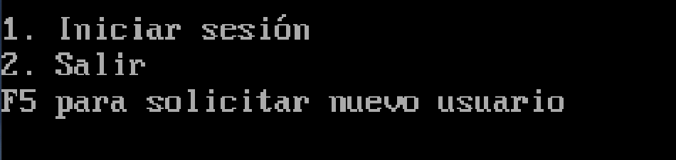

## Creación de usuario
Para crear un usuario, es necesario ingresar el nombre de usuario, y la contraseña. 

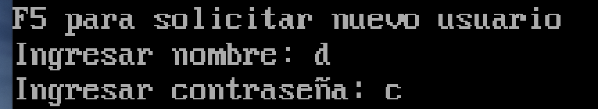

## Inicio de sesión
Para iniciar sesión, es necesario que el usuario exista, que la contraseña sea correcta, y que su estado sea ACTIVO. 

De lo contrario se mostrará el siguiente mensaje de error.

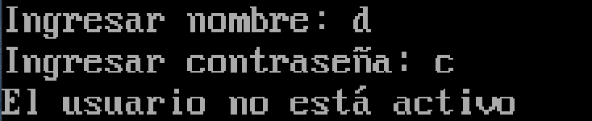

Si el usuario existe, y la contraseña es correcta, se mostrará el siguiente mensaje de éxito.
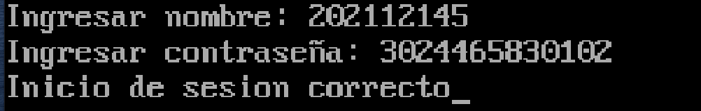

## Menú de administrador global
El menú de administrador global permite realizar las siguientes acciones:
- Iniciar juego
- Inactivar usuario
- Activar usuario
- Generar reportes globales
- Cerrar sesión

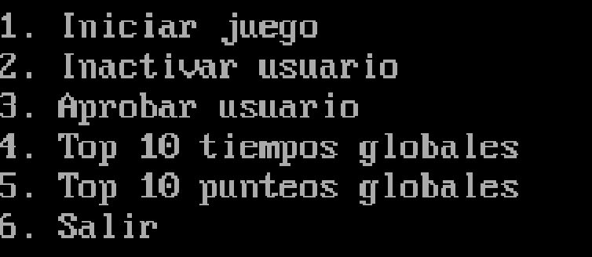

El juego se detalla en la sección [Descripción del juego](#descripción-del-juego)

## Inactivar usuario
Para inactivar un usuario, es necesario ingresar el nombre de usuario del usuario que se desea inactivar. Si el usuario existe, y su estado es ACTIVO, se mostrará el siguiente mensaje de éxito.


## Activar usuario
Se muestra una lista de todos los usuarios, y se pueden realizar tres acciones:
- Activar usuario
- Siguiente
- Regresar

También se mostrará el nombre del usuario

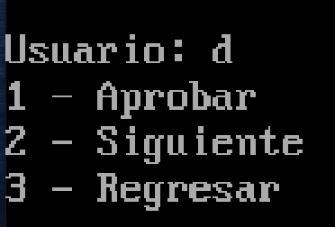

Si se activa un usuario, se solicitará establecer que tipo de usuario será, y se mostrará el siguiente mensaje de éxito.

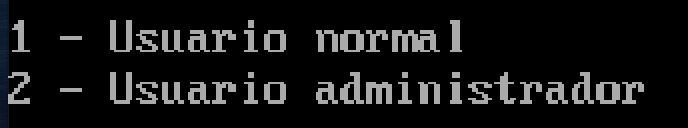

## Menu de usuario normal
El menú de usuario normal permite realizar las siguientes acciones:
- Iniciar juego
- Generar reportes personales
- Cerrar sesión

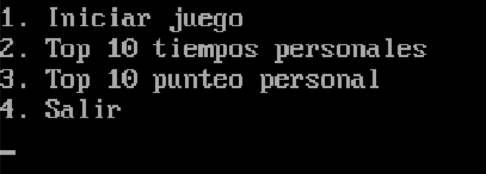

## Menu de usuario administrador
El menú de usuario administrador permite realizar las siguientes acciones:
- Iniciar juego
- Generar reportes tanto personales como globales
- Cerrar sesión

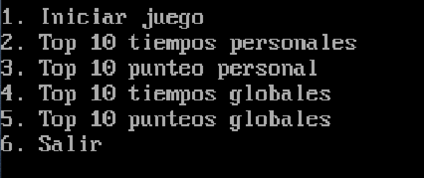


## Reportes
Los reportes se pueden generar tanto para un usuario en específico, como para todos los usuarios. Los reportes se generan en formato .txt, y se guardan en la carpeta `reports` en la raíz del proyecto.

Cuando se selecciona la opción de generar reportes, se muestra un menú con las siguientes opciones:

### Tipo de ordenamiento
Se puede seleccionar el tipo de ordenamiento que se desea utilizar para generar el reporte. Las opciones son:
- Bubble sort
- Cocktail sort
- Prime sort

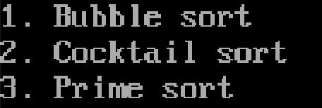

### Métrica 
Se puede seleccionar la métrica que se desea utilizar para generar el reporte. Las opciones son:
- Puntaje
- Tiempo

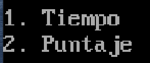

### Dirección del ordenamiento
Se puede seleccionar la dirección del ordenamiento que se desea utilizar para generar el reporte. Las opciones son:
- Ascendente
- Descendente

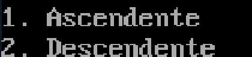

## Descripción del juego
El juego consiste en un laberinto en el cual se encuentran distribuidos puntos y enemigos. El jugador debe recolectar todos los puntos para ganar. El jugador puede moverse en cuatro direcciones: arriba, abajo, izquierda y derecha. Los enemigos se mueven de forma aleatoria en el laberinto. El jugador puede perder si es alcanzado por un enemigo más de tres veces.

## Requerimientos
Para poder jugar a este juego, es necesario tener instalado un emulador de entorno de sistema operativo DOS (Disk Operating System), como por ejemplo [DOSBox](https://www.dosbox.com/). Además, es necesario tener instalado el compilador de lenguaje ensamblador x86, [MASM](https://www.masm32.com/).

## Instalación
Para poder jugar a este juego, es necesario ejecutar el archivo .EXE llamado `main.exe`que se encuentra en la raíz del proyecto. Para ello, es necesario abrir el emulador de DOSBox y ejecutar el comando `main.exe`.
```bash
main.exe
```

## Controles
Para poder jugar a este juego, es necesario utilizar las siguientes teclas:
- `Tecla ariba`: Mover hacia arriba.
- `Tecla abajo`: Mover hacia abajo.
- `Tecla izquierda`: Mover hacia la izquierda.
- `Tecla derecha`: Mover hacia la derecha.

## Inicio
Cada vez que se inicie un juego, se mostrará lo siguiente
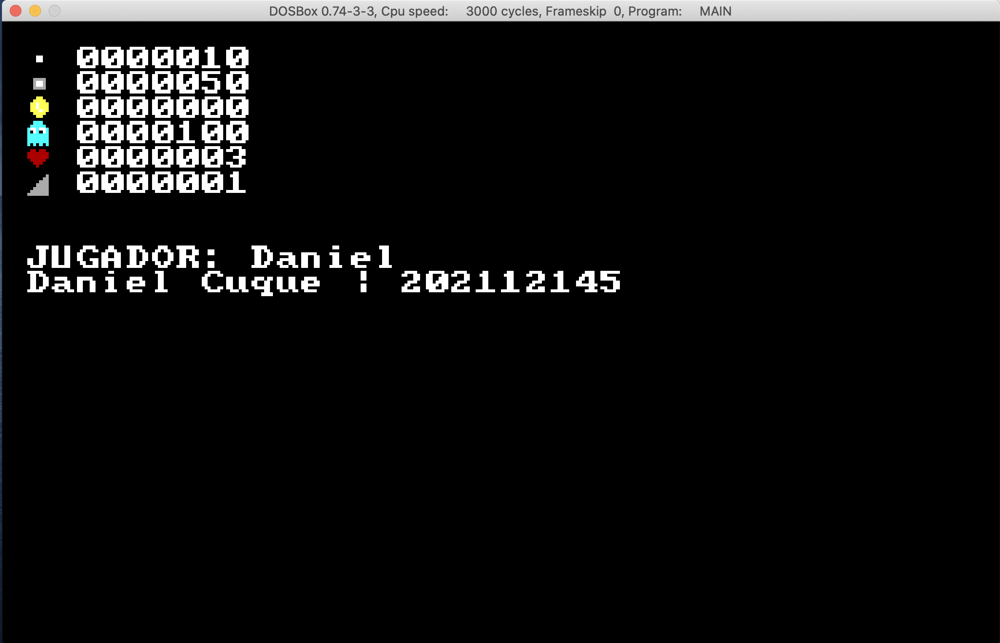

- Valor de los ace dots
- Valor de los power dots
- Puntaje actual
- Valor de los fantasmas
- Vidas restantes
- Nivel actual

Adicional se mostrará el nombre del jugador, y el autor

## Juego

El juego mostrará en la parte superior izquierda, el puntaje actual del jugador, y en la parte superior derecha, se mostrará el cronómetro del juego.

En la parte inferior izquierda se mostrará una cuenta regresiva de 12s si el jugador consume un power dot.

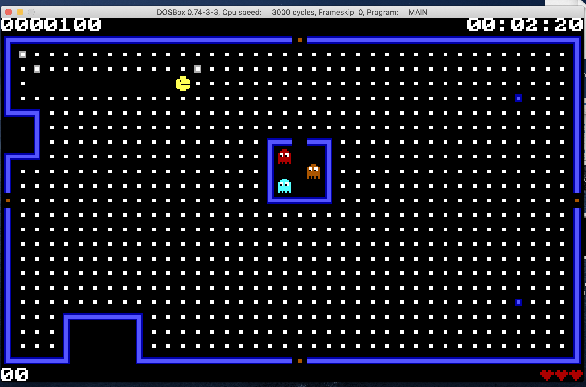

Cuando un jugador consume un power dot, los fantasmas se volverán azules, y podrán ser comestibles.

El primer fantasma que se consuma, dará 100 puntos, el segundo 200, el tercero 400 y el cuarto 800. Además, estos fantasmas volverán a su posición inicial.


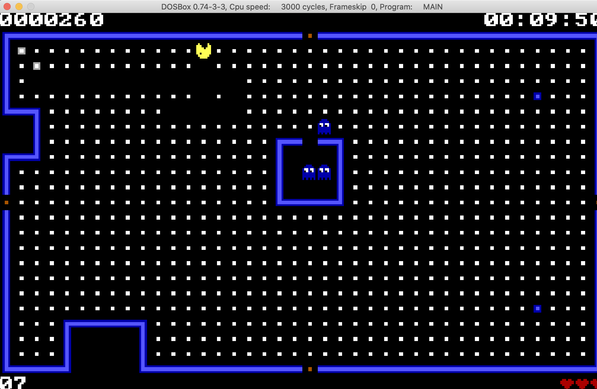

Si el jugador es alcanzado por un fantasma, perderá una vida, y volverá a su posición inicial. Si el jugador pierde todas sus vidas, el juego terminará.

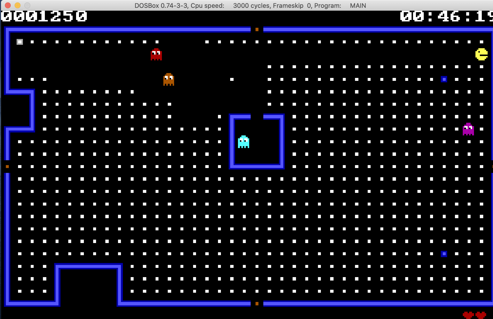

Dentro del juego, es posible que existan portales, los cuales permiten al jugador moverse de un lado a otro del laberinto.
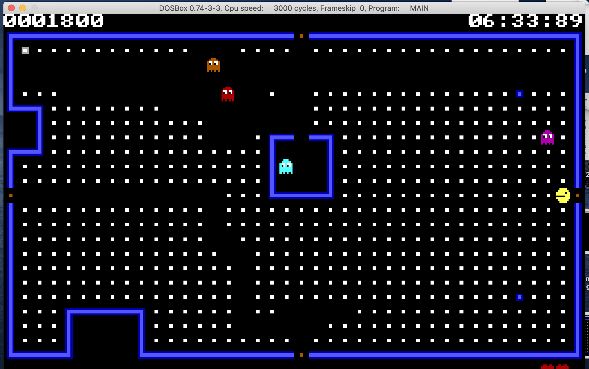

## Elementos del juego
- **Aceman**: El jugador, el cual debe recolectar todos los puntos para ganar.
- **Puntos**: Los puntos son los elementos que el jugador debe recolectar para ganar. Cada punto tiene un valor de 10 puntos.
- **Power dots**: Los power dots son los elementos que el jugador debe recolectar para poder comerse a los fantasmas. Cada power dot tiene un valor de 50 puntos.
- **Fantasmas**: Los fantasmas son los enemigos del jugador. El jugador debe evitar a los fantasmas, ya que si es alcanzado por un fantasma, perderá una vida. Cada fantasma tiene un valor de 100 puntos.
- **Portales**: Los portales son elementos que permiten al jugador moverse de un lado a otro del laberinto.

## Puntaje
El puntaje se calcula de la siguiente manera:
- Por cada punto recolectado, se suman el valor dentro del archivo de entrada.
- Por cada power dot, su valor vale x5 al de los acedots.

## Finalización del juego
El juego termina cuando el jugador recolecta todos los puntos, o cuando el jugador es alcanzado por un fantasma más de tres veces.